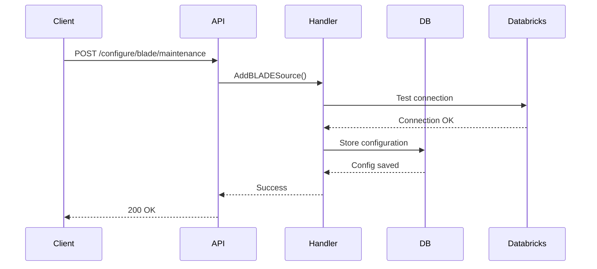
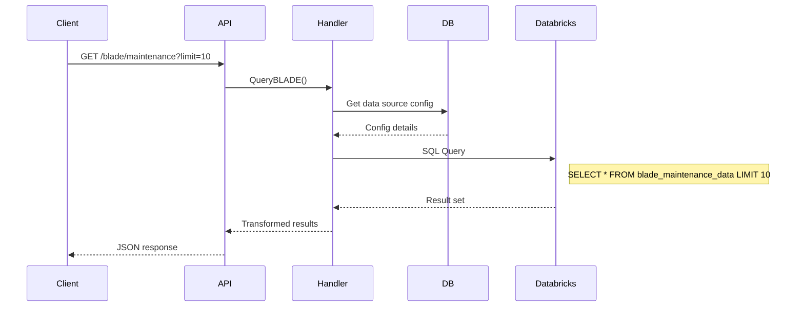
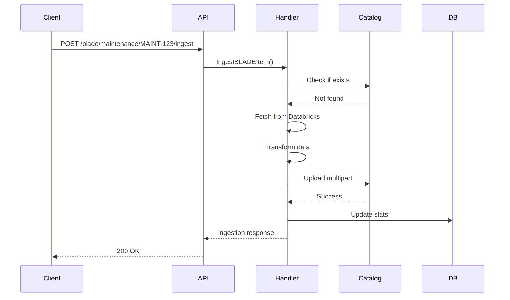
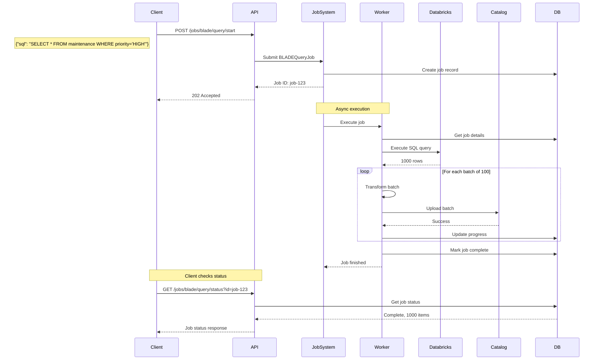

# Data Flow Through the System

This document traces how BLADE data flows from Databricks to the catalog.

## Overview

```
Mock Databricks → BLADE Service → Catalog
       ↑              ↓             ↓
       └── Config ←───┴── Status ───┘
         (PostgreSQL)
```

## Detailed Flow Scenarios

### 1. Configuration Phase

Before any data can flow, a BLADE data source must be configured:



**Configuration Data:**
```json
{
  "name": "blade-maintenance",
  "displayName": "BLADE Maintenance Data",
  "dataType": "maintenance",
  "enabled": true,
  "config": {
    "catalog": "main",
    "schema": "blade",
    "table": "blade_maintenance_data",
    "warehouse_id": "test-warehouse"
  }
}
```

### 2. Direct Query Flow

User queries BLADE data directly (synchronous):



### 3. Single Item Ingestion Flow

Ingest a specific BLADE item:



### 4. Async Query Job Flow

The main pattern - async BLADE query and catalog:



### 5. Data Transformation Pipeline

How data is transformed at each stage:

```
1. Databricks Raw Data
┌─────────────────────────────────┐
│ {                               │
│   "tail_number": "AF-001",      │
│   "maint_type": "scheduled",    │
│   "description": "Engine check", │
│   "due_date": "2024-01-15",    │
│   "priority": "HIGH"            │
│ }                               │
└─────────────────────────────────┘
                ↓
2. BLADE Service Processing
┌─────────────────────────────────┐
│ BLADEItem {                     │
│   ItemID: "MAINT-AF-001-2024", │
│   DataType: "maintenance",      │
│   Data: { structured json },    │
│   Classification: "UNCLASS",    │
│   LastModified: "2024-01-10",  │
│   Metadata: {                   │
│     "source": "databricks",     │
│     "warehouse": "test-01"      │
│   }                            │
│ }                               │
└─────────────────────────────────┘
                ↓
3. Catalog Upload Format
┌─────────────────────────────────┐
│ Multipart Form:                 │
│ - file: blade_item.json         │
│ - dataSource: "BLADE:maintenance"│
│ - classification: "UNCLASS"     │
│ - metadata: { json metadata }   │
│ - timestamp: "2024-01-10T10:00Z"│
└─────────────────────────────────┘
```

## Job Control Flow

### Starting a Job
```
Client → StartBLADEQueryJob → Create Job → Queue → Worker Pool
```

### Pausing a Job
```
Client → PauseJob → Set Pause Flag → Worker Checks Flag → Waits
```

### Resuming a Job
```
Client → ResumeJob → Clear Pause Flag → Worker Continues
```

### Job Progress Updates
```
Worker → Process Batch → Update DB → Client Polls Status → See Progress
```

## Error Handling Flow

### Transient Errors (Retry)
```
Query Fails → Log Error → Wait 2s → Retry (3x) → Success/Fail
```

### Item-Level Errors (Skip)
```
Item Process Fails → Log Error → Update Stats → Continue Next Item
```

### Fatal Errors (Stop)
```
Connection Lost → Cancel Job → Update Status → Notify Client
```

## Performance Considerations

### Batching Strategy
```
1000 items to process
├── Batch 1 (100 items) → Worker 1
├── Batch 2 (100 items) → Worker 2
├── Batch 3 (100 items) → Worker 3
└── ... (concurrent processing)
```

### Rate Limiting
```
for item in batch {
    process(item)
    catalog.upload(item)
    time.Sleep(100ms) // Rate limit
}
```

## State Management

### Job States
```
PENDING → RUNNING → COMPLETED
           ↓    ↑
         PAUSED
           ↓
        CANCELLED/FAILED
```

### Progress Tracking
```json
{
  "jobId": "job-123",
  "status": "RUNNING",
  "totalItems": 1000,
  "processedItems": 450,
  "successCount": 445,
  "errorCount": 5,
  "currentOperation": "Processing batch 5/10",
  "estimatedCompletion": "2024-01-10T15:30:00Z"
}
```

## Next Steps

Now that you understand the architecture, patterns, and data flow, continue to [01-setup/01-project-structure.md](../01-setup/01-project-structure.md) to begin implementation →